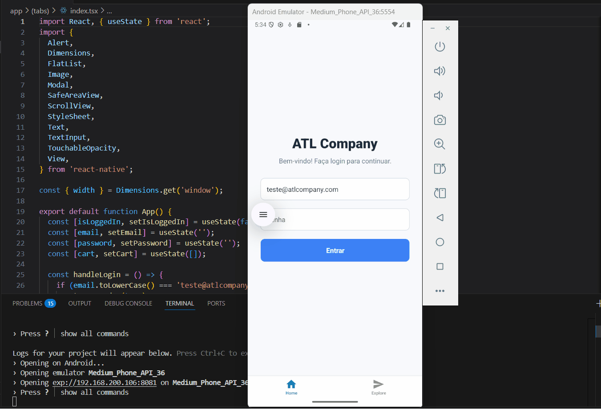

# ATL Company - Marketplace Mobile para Projetos de Artesanato 🛒 | Projeto de Extensão em React Native ⚛️


ATL Company é um aplicativo mobile de marketplace desenvolvido com React Native. Seu principal objetivo é digitalizar as vendas de uma artesã local (Luciane Maria), promovendo sua inclusão digital e ampliando o alcance de seus produtos no ambiente virtual.

## ✍️ Descrição
Este projeto tem como objetivo principal a aplicação prática dos conhecimentos adquiridos nas aulas de **Programação para Dispositivos Móveis em Android** administradas pelo professor **Ronaldo Cândido**, dentro do contexto de um programa de extensão universitário. A proposta envolve o desenvolvimento de um aplicativo mobile, construído com React Native, que funcione como um marketplace voltado à comercialização de produtos artesanais.

A solução foi pensada para atender às necessidades da artesã Luciane Maria, permitindo a digitalização de seu catálogo de produtos e proporcionando uma vitrine virtual acessível e intuitiva. A plataforma facilita a exibição organizada dos itens disponíveis para venda, ampliando seu alcance para além do comércio físico e promovendo maior visibilidade de seu trabalho artesanal.

## ⚒️ Tecnologias utilizadas:
- React Native;
- Expo;
- Node;
- Android Studio;
- JDK;
- Visual Studio Code;
- Git;
- GitHub.

## 🚀 Funcionalidades Atuais
- Sistema de Login;
- Visualização de produtos artesanais;
- Interface adaptada para dispositivos móveis;
- Estrutura de navegação intuitiva;

## 🖼️ Demonstração do projeto:
<p align="center">
  
</p>

## 🧰 Como Executar o Projeto

1.  Clone o repositório:

```bash
git clone https://github.com/quint-ino/projeto-mobile.git
```
2. Instalar dependências:

```bash
npm install
```

3. Inicie o aplicativo:

```bash
npm start
```

No terminal, você encontrará as seguintes alternativas para rodar o aplicativo:

- [Development build](https://docs.expo.dev/develop/development-builds/introduction/)
- [Android emulator](https://docs.expo.dev/workflow/android-studio-emulator/)
- [iOS simulator](https://docs.expo.dev/workflow/ios-simulator/)
- [Expo Go](https://expo.dev/go)


## 👥 Participantes do projeto:
- **Alisson Dalbem** - Desenvolvimento front-end e relacionamento direto com a artesã beneficiária;
- **Herbert Luiz** - Design do projeto;
- **Leonardo Oliveira** - Organização geral, distribuição de tarefas e apresentação final do projeto;
- **Matheus Quintino** - Desenvolvimento back-end;
- **Nathália Anastácio** - Roteiro e design dos slides de apresentação.
